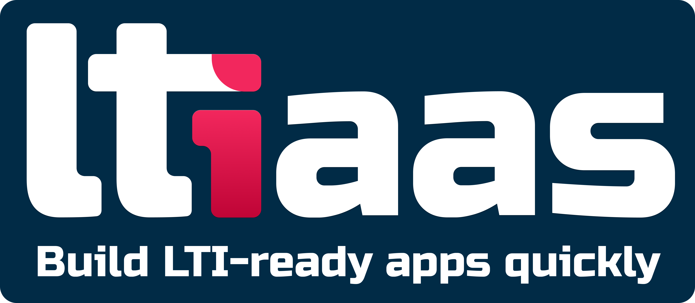

# LTI 1.3 Publish as LTI Advantage Tool Moodle Plugin

Turn your Moodle server into an LTI 1.3 capable Tool Provider. This feature enables the following LTI 1.3 capabilities:

- Publish any course or activity/module as an LTI resource to be consumed by an LMS
- Auto-publish grades of completed activities back to the LMS via asynchronous tasks
- Display a deep-linking content selection view to teachers so they can select specific activities to be added to the LMS as separate grade-lines.

## Powered By LTIAAS

This Moodle plugin uses [LTIAAS](https://ltiaas.com) to manage the LTI protocol. To use this plugin, you must first [create a FREE LTIAAS account](https://ltiaas.com/guides/account-setup).

## Install/Settings

This plugin is installed in Moodle just like any other plugin:

1. [Create a FREE LTIAAS account](https://ltiaas.com/guides/account-setup)
2. Choose the latest plugin release from GitHub and download **ltiaas.zip**.
3. Login to your Moodle server as an admin.
4. Navigate to `Site administration` -> `Plugins` -> `Install plugins`.
5. Upload **litaas.zip** and click `Install plugin from the ZIP file`.
6. Follow the instructions to install the plugin. Enter in the URL and API key you got from step 1.
    - **Ltiaas URL**: Ltiaas Server URL.
    - **API Key**: API Key used to authenticate requests to Ltiaas.
7. Enable the plugin:
    1. Navigate to `Plugins` -> `Enrolments` -> `Manage enrol plugins`.
    2. Click the `eye` icon next to `Publish as LTI Advantage tool with LTIAAS` to enable the plugin.
    3. Click the `settings` link to change any plugin settings if needed.

## Publish an Activity

Once the plugin is isntalled and enabeld, you can add activities to be published for LTI. To do this:
1. Navigate to a course as an admin/teacher.
2. Click `More` -> `Published as LTI Advantage tools with LTIAAS`.
3. Click the `Add` button.
4. Fill out the form.
    1. Choose the whole course or an activity within the course using the `Tool to be published` drop-down.

> If you are using deep-linking, all published tools will appear in the deep-linking content selection page.

> If you are not using deep-linking, you can copy the link to the activity from the `Launch URL` column of the table. This URL needs to be given to the LMS when launching the activity.